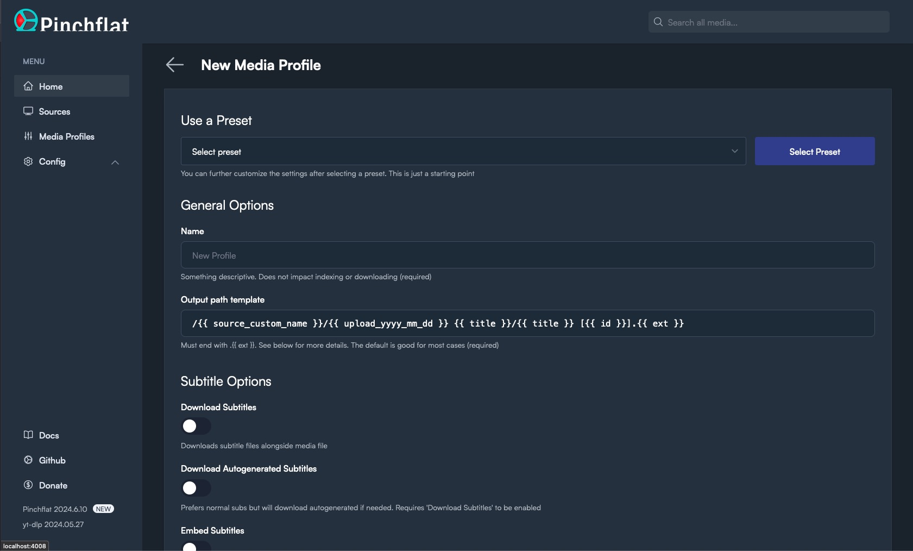
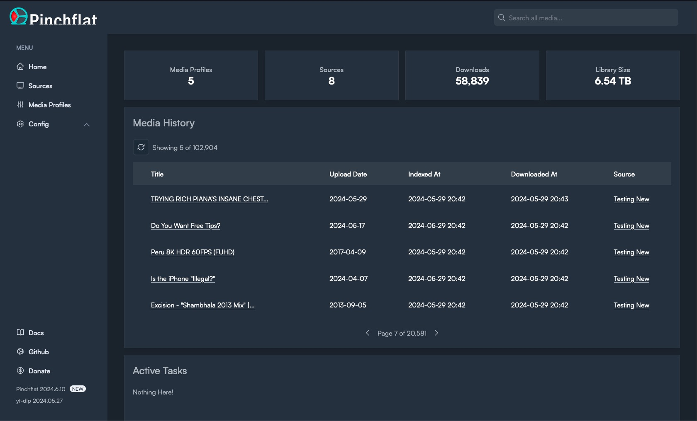

> [!IMPORTANT]  
> (2025-02-14) [zakkarry](https://github.com/sponsors/zakkarry), who is a collaborator on [cross-seed](https://github.com/cross-seed/cross-seed) and an extremely helpful community member in general, is facing hard times due to medical debt and family illness. If you're able, please consider [sponsoring him on GitHub](https://github.com/sponsors/zakkarry) or donating via [buymeacoffee](https://tip.ary.dev). Tell him I sent you!

<p align="center">  
  
</p>

<p align="center">  
  <sup>
    <em>logo by <a href="https://github.com/hernandito" target="_blank">@hernandito</a></em>
  </sup>
</p>

<div align="center">

[](LICENSE)
[](https://github.com/kieraneglin/pinchflat/releases)
[](https://discord.gg/j7T6dCuwU4)
[](#)
[](https://vscode.dev/redirect?url=vscode://ms-vscode-remote.remote-containers/cloneInVolume?url=https://github.com/kieraneglin/pinchflat)

</div>

# Your next YouTube media manager

## Table of contents:

- [What it does](#what-it-does)
- [Features](#features)
- [Screenshots](#screenshots)
- [Installation](#installation)
  - [Unraid](#unraid)
  - [Portainer](#portainer)
  - [Docker](#docker)
  - [Environment Variables](#environment-variables)
  - [A note on reverse proxies](#reverse-proxies)
- [Username and Password (authentication)](https://github.com/kieraneglin/pinchflat/wiki/Username-and-Password)
- [Frequently asked questions](https://github.com/kieraneglin/pinchflat/wiki/Frequently-Asked-Questions)
- [Documentation](https://github.com/kieraneglin/pinchflat/wiki)
- [EFF donations](#eff-donations)
- [Pre-release disclaimer](#pre-release-disclaimer)
- [Development and Contributing](https://github.com/kieraneglin/pinchflat/wiki/Development-and-Contributing)

## What it does

Pinchflat is a self-hosted app for downloading YouTube content built using [yt-dlp](https://github.com/yt-dlp/yt-dlp). It's designed to be lightweight, self-contained, and easy to use. You set up rules for how to download content from YouTube channels or playlists and it'll do the rest, periodically checking for new content. It's perfect for people who want to download content for use in with a media center app (Plex, Jellyfin, Kodi) or for those who want to archive media!

While you can [download individual videos](https://github.com/kieraneglin/pinchflat/wiki/Frequently-Asked-Questions#how-do-i-download-one-off-videos), Pinchflat is best suited for downloading content from channels or playlists. It's also not meant for consuming content in-app - Pinchflat downloads content to disk where you can then watch it with a media center app or VLC.

If it doesn't work for your use case, please make a feature request! You can also check out these great alternatives: [Tube Archivist](https://github.com/tubearchivist/tubearchivist), [ytdl-sub](https://github.com/jmbannon/ytdl-sub), and [TubeSync](https://github.com/meeb/tubesync)

## Features

- Self-contained - just one Docker container with no external dependencies
- Powerful naming system so content is stored where and how you want it
- Easy-to-use web interface with presets to get you started right away
- First-class support for media center apps like Plex, Jellyfin, and Kodi ([docs](https://github.com/kieraneglin/pinchflat/wiki/Frequently-Asked-Questions#how-do-i-get-media-into-plexjellyfinkodi))
- Supports serving RSS feeds to your favourite podcast app ([docs](https://github.com/kieraneglin/pinchflat/wiki/Podcast-RSS-Feeds))
- Automatically downloads new content from channels and playlists
  - Uses a novel approach to download new content more quickly than other apps
- Supports downloading audio content
- Custom rules for handling YouTube Shorts and livestreams
- Apprise support for notifications
- Allows automatically redownloading new media after a set period
  - This can help improve the download quality of new content or improve SponsorBlock tags
- Optionally automatically delete old content ([docs](https://github.com/kieraneglin/pinchflat/wiki/Automatically-Delete-Media))
- Advanced options like setting cutoff dates and filtering by title ([docs](https://github.com/kieraneglin/pinchflat/wiki/Frequently-Asked-Questions#i-only-want-certain-videos-from-a-source---how-can-i-only-download-those))
- Reliable hands-off operation
- Can pass cookies to YouTube to download your private playlists ([docs](https://github.com/kieraneglin/pinchflat/wiki/YouTube-Cookies))
- Sponsorblock integration
- \[Advanced\] allows custom `yt-dlp` options ([docs](https://github.com/kieraneglin/pinchflat/wiki/%5BAdvanced%5D-Custom-yt%E2%80%90dlp-options))
- \[Advanced\] supports running custom scripts when after downloading/deleting media (alpha - [docs](https://github.com/kieraneglin/pinchflat/wiki/%5BAdvanced%5D-Custom-lifecycle-scripts))

## Screenshots




## Installation

### Unraid

Simply search for Pinchflat in the Community Apps store!

### Portainer

> [!IMPORTANT]  
> See the note below about storing config on a network file share. It's preferred to store the config on a local disk if at all possible.

Docker Compose file:

```yaml
version: '3'
services:
  pinchflat:
    image: ghcr.io/kieraneglin/pinchflat:latest
    environment:
      # Set the timezone to your local timezone
      - TZ=America/New_York
    ports:
      - '8945:8945'
    volumes:
      - /host/path/to/config:/config
      - /host/path/to/downloads:/downloads
```

### Docker

1. Create two directories on your host machine: one for storing config and one for storing downloaded media. Make sure they're both writable by the user running the Docker container.
2. Prepare the docker image in one of the two ways below:
   - **From GHCR:** `docker pull ghcr.io/kieraneglin/pinchflat:latest`
     - NOTE: also available on Docker Hub at `keglin/pinchflat:latest`
   - **Building locally:** `docker build . --file docker/selfhosted.Dockerfile -t ghcr.io/kieraneglin/pinchflat:latest`
3. Run the container:

```bash
# Be sure to replace /host/path/to/config and /host/path/to/downloads below with
# the paths to the directories you created in step 1
# Be sure to replace America/New_York with your local timezone
docker run \
  -e TZ=America/New_York \
  -p 8945:8945 \
  -v /host/path/to/config:/config \
  -v /host/path/to/downloads:/downloads \
  ghcr.io/kieraneglin/pinchflat:latest
```

### Podman

The Podman setup is similar to Docker but changes a few flags to run under a User Namespace instead of root. To run Pinchflat under Podman and use the current user's UID/GID for file access run this:

```
podman run \
  --security-opt label=disable \
  --userns=keep-id --user=$UID \
  -e TZ=America/Los_Angeles \
  -p 8945:8945 \
  -v /host/path/to/config:/config:rw \
  -v /host/path/to/downloads/:/downloads:rw \
  ghcr.io/kieraneglin/pinchflat:latest
```

Using this setup consider creating a new `pinchflat` user and giving that user ownership to the config and download directory. See [Podman --userns](https://docs.podman.io/en/v4.6.1/markdown/options/userns.container.html) docs.

### IMPORTANT: File permissions

You _must_ ensure the host directories you've mounted are writable by the user running the Docker container. If you get a permission error follow the steps it suggests. See [#106](https://github.com/kieraneglin/pinchflat/issues/106) for more.

> [!IMPORTANT]
> It's not recommended to run the container as root. Doing so can create permission issues if other apps need to work with the downloaded media.

### ADVANCED: Storing Pinchflat config directory on a network share

As pointed out in [#137](https://github.com/kieraneglin/pinchflat/issues/137), SQLite doesn't like being run in WAL mode on network shares. If you're running Pinchflat on a network share, you can disable WAL mode by setting the `JOURNAL_MODE` environment variable to `delete`. This will make Pinchflat run in rollback journal mode which is less performant but should work on network shares.

> [!CAUTION]
> Changing this setting from WAL to `delete` on an existing Pinchflat instance could, conceivably, result in data loss. Only change this setting if you know what you're doing, why this is important, and are okay with possible data loss or DB corruption. Backup your database first!

If you change this setting and it works well for you, please leave a comment on [#137](https://github.com/kieraneglin/pinchflat/issues/137)! Doubly so if it does _not_ work well.

### Environment variables

| Name                        | Required? | Default                   | Notes                                                                                                                                     |
| --------------------------- | --------- | ------------------------- | ----------------------------------------------------------------------------------------------------------------------------------------- |
| `TZ`                        | No        | `UTC`                     | Must follow IANA TZ format                                                                                                                |
| `LOG_LEVEL`                 | No        | `debug`                   | Can be set to `info` but `debug` is strongly recommended                                                                                  |
| `UMASK`                     | No        | `022`                     | Unraid users may want to set this to `000`                                                                                                |
| `BASIC_AUTH_USERNAME`       | No        |                           | See [authentication docs](https://github.com/kieraneglin/pinchflat/wiki/Username-and-Password)                                            |
| `BASIC_AUTH_PASSWORD`       | No        |                           | See [authentication docs](https://github.com/kieraneglin/pinchflat/wiki/Username-and-Password)                                            |
| `EXPOSE_FEED_ENDPOINTS`     | No        | `false`                   | See [RSS feed docs](https://github.com/kieraneglin/pinchflat/wiki/Podcast-RSS-Feeds)                                                      |
| `ENABLE_IPV6`               | No        | `false`                   | Setting to _any_ non-blank value will enable IPv6                                                                                         |
| `JOURNAL_MODE`              | No        | `wal`                     | Set to `delete` if your config directory is stored on a network share (not recommended)                                                   |
| `TZ_DATA_DIR`               | No        | `/etc/elixir_tzdata_data` | The container path where the timezone database is stored                                                                                  |
| `BASE_ROUTE_PATH`           | No        | `/`                       | The base path for route generation. Useful when running behind certain reverse proxies - prefixes must be stripped.                       |
| `YT_DLP_WORKER_CONCURRENCY` | No        | `2`                       | The number of concurrent workers that use `yt-dlp` _per queue_. Set to 1 if you're getting IP limited, otherwise don't touch it           |
| `ENABLE_PROMETHEUS`         | No        | `false`                   | Setting to _any_ non-blank value will enable Prometheus. See [docs](https://github.com/kieraneglin/pinchflat/wiki/Prometheus-and-Grafana) |

### Reverse Proxies

Pinchflat makes heavy use of websockets for real-time updates. If you're running Pinchflat behind a reverse proxy then you'll need to make sure it's configured to support websockets.

## EFF donations

Prior to 2024-05-10, a portion of all donations were given to the [Electronic Frontier Foundation](https://www.eff.org/). Now, the app doesn't accept donations that go to me personally and instead directs you straight to the EFF. [Here](https://github.com/kieraneglin/pinchflat/issues/234) are some people that have generously donated.

The EFF defends your online liberties and [backed](https://github.com/github/dmca/blob/9a85e0f021f7967af80e186b890776a50443f06c/2020/11/2020-11-16-RIAA-reversal-effletter.pdf) `youtube-dl` when Google took them down.

## Stability disclaimer

This software is in active development and anything can break at any time. I make no guarantees about the stability of this software, forward-compatibility of updates, or integrity (both related to and independent of Pinchflat).

## License

See `LICENSE` file

<!-- Images and links -->

[license-badge]: https://img.shields.io/github/license/kieraneglin/pinchflat?style=for-the-badge&color=ee512b
[license-badge-url]: LICENSE
