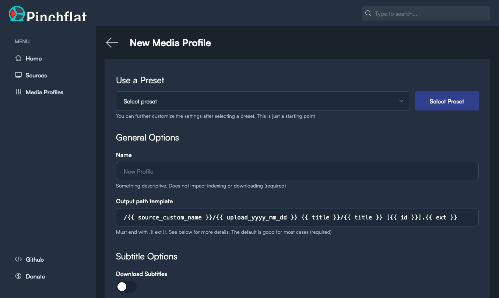
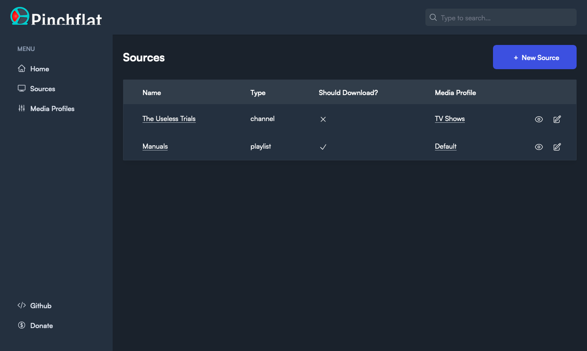

<p align="center">  
  
</p>

<p align="center">  
  <sup>
    <em>logo by <a href="https://github.com/hernandito" target="_blank">@hernandito</a></em>
  </sup>
</p>

# Your next YouTube media manager

## Table of contents:

- [What it does](#what-it-does)
- [Features](#features)
- [Screenshots](#screenshots)
- [Installation](#installation)
  - [Unraid](#unraid)
  - [Docker](#docker)
- [Username and Password (authentication)](https://github.com/kieraneglin/pinchflat/wiki/Username-and-Password)
- [Frequently asked questions](https://github.com/kieraneglin/pinchflat/wiki/Frequently-Asked-Questions)
- [Documentation](https://github.com/kieraneglin/pinchflat/wiki)
- [EFF donations](#eff-donations)
- [Pre-release disclaimer](#pre-release-disclaimer)
- [Development and Contributing](https://github.com/kieraneglin/pinchflat/wiki/Development-and-Contributing)

## What it does

Pinchflat is a self-hosted app for downloading YouTube content built using [yt-dlp](https://github.com/yt-dlp/yt-dlp). It's designed to be lightweight, self-contained, and easy to use. You set up rules for how to download content from YouTube channels or playlists and it'll do the rest, checking periodically for new content. It's perfect for people who want to download content for use in with a media center app (Plex, Jellyfin, Kodi) or for those who want to archive media!

It's _not_ great for downloading one-off videos - it's built to download large amounts of content and keep it up to date. It's also not meant for consuming content in-app - Pinchflat downloads content to disk where you can then watch it with a media center app or VLC.

If it doesn't work for your use case, please make a feature request! You can also check out these great alternatives: [Tube Archivist](https://github.com/tubearchivist/tubearchivist), [ytdl-sub](https://github.com/jmbannon/ytdl-sub), and [TubeSync](https://github.com/meeb/tubesync)

## Features

- Self-contained - just one Docker container with no external dependencies
- Powerful naming system so content is stored where and how you want it
- Easy-to-use web interface with presets to get you started right away
- First-class support for media center apps like Plex, Jellyfin, and Kodi
- Supports serving RSS feeds to your favourite podcast app (beta - [docs](<https://github.com/kieraneglin/pinchflat/wiki/Podcast-RSS-Feeds-(beta)>))
- Automatically downloads new content from channels and playlists
  - Uses a novel approach to download new content more quickly than other apps
- Supports downloading audio content
- Custom rules for handling YouTube Shorts and livestreams
- Advanced options like setting cutoff dates and filtering by title
- Reliable hands-off operation
- Can pass cookies to YouTube to download your private playlists ([docs](https://github.com/kieraneglin/pinchflat/wiki/YouTube-Cookies))

## Screenshots




## Installation

### Unraid

Simply search for Pinchflat in the Community Apps store!

### Portainer

Docker Compose file:

```yaml
version: '3'
services:
  pinchflat:
    image: keglin/pinchflat:latest
    ports:
      - '8945:8945'
    volumes:
      - /host/path/to/config:/config
      - /host/path/to/downloads:/downloads
```

### Docker

1. Create two directories on your host machine: one for storing config and one for storing downloaded media. Make sure they're both writable by the user running the Docker container.
2. Prepare the docker image in one of the two ways below:
   - **From GHCR:** `docker pull ghcr.io/kieraneglin/pinchflat:latest`
     - NOTE: also available on Docker Hub at `keglin/pinchflat:latest`
   - **Building locally:** `docker build . --file selfhosted.Dockerfile -t ghcr.io/kieraneglin/pinchflat:latest`
3. Run the container:

```bash
# Be sure to replace /host/path/to/config and /host/path/to/downloads below with
# the paths to the directories you created in step 1
docker run \
  -p 8945:8945 \
  -v /host/path/to/config:/config \
  -v /host/path/to/downloads:/downloads \
  ghcr.io/kieraneglin/pinchflat:latest
```

### IMPORTANT: File permissions

You _must_ ensure the host directories you've mounted are writable by the user running the Docker container. If you get a permission error follow the steps it suggests. See [#106](https://github.com/kieraneglin/pinchflat/issues/106) for more.

It's recommended to not run the container as root. Doing so can create permission issues if other apps need to work with the downloaded media. If you need to run any command as root, you can run `su` from the container's shell as there is no password set for the root user.

## EFF donations

A portion of all donations to Pinchflat will be donated to the [Electronic Frontier Foundation](https://www.eff.org/). The EFF defends your online liberties and [backed](https://github.com/github/dmca/blob/9a85e0f021f7967af80e186b890776a50443f06c/2020/11/2020-11-16-RIAA-reversal-effletter.pdf) `youtube-dl` when Google took them down. [See here](https://github.com/kieraneglin/pinchflat/wiki/EFF-Donation-Receipts) for a list of donation receipts.

## Pre-release disclaimer

This is pre-release software and anything can break at any time. I make not guarantees about the stability of this software, forward-compatibility of updates, or integrity (both related to and independent of Pinchflat). Essentially, use at your own risk and expect there will be rough edges for now.

## License

See `LICENSE` file
